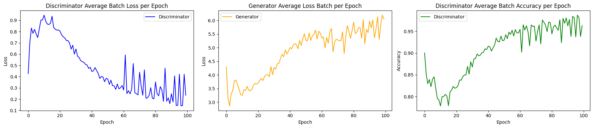
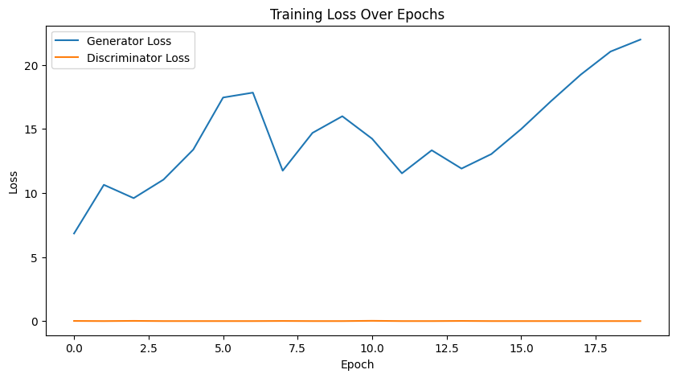

# Text-to-Image Generation Using Latent Diffusion Models and Conditional GANs

## Project Overview
This project uses advanced AI techniques to generate vivid and expressive images from textual descriptions. Our approach integrates Conditional Generative Adversarial Networks (cGANs) and Latent Diffusion Models (LDMs) to bridge the semantic gap between textual inputs and visual outputs. We explore multiple architectures, including a BERT-based text encoder, to generate high-quality, contextually accurate images.

This model implements three models:
* Pre-trained LDM Model
* cGAN using AFHQ dataset
* cGAN BERT model usiing COCO dataset


# 1. Pretrained LDM Model

## Dependencies 
Install the required packages using the commands below:

```cmd
pip install transformers==4.19.2 scann kornia==0.6.4 torchmetrics==0.6.0
pip install git+https://github.com/arogozhnikov/einops.git
```

## Running LDM Model

The file contains all the code that is necessary to run the model. It dosen't require additional files.

* Load the code in colab and run Inferencing_LDM.ipynb cells 

## Results using the LDM model


# 2. cGAN using AFHQ dataset
* run cgan_afhq.ipynb 

## Dataset 
Dataset can be downloaded from below mentioned link
[https://www.kaggle.com/datasets/andrewmvd/animal-faces](https://www.kaggle.com/datasets/andrewmvd/animal-faces)

## Results




# 3. cGAN BERT model using COCO dataset
This project implements a Conditional Generative Adversarial Network (GAN) to generate images based on textual descriptions. The model uses a pre-trained BERT model for text encoding and a deep convolutional neural network for the generator and discriminator.

## Dataset

The model is trained on the COCO dataset, specifically the `train2017` subset along with its annotations. The COCO dataset contains images with corresponding textual descriptions (captions).

[https://cocodataset.org/#download](https://cocodataset.org/#download)

2017 Train Images is used in this project. It has roughly 118k images and is about 18 GB in size.

## Model Architecture

### Text Encoder

- **BERT-Based Text Encoder:** Uses a pre-trained BERT model to convert text descriptions into feature vectors.

### Generator

- **Input:** Concatenates noise vector and text embedding.
- **Architecture:**
  - Fully Connected Layer
  - Three Transposed Convolutional (Deconvolutional) Layers
  - ReLU activations followed by Tanh activation

### Discriminator

- **Input:** Takes an image and a text embedding.
- **Architecture:**
  - Three Convolutional Layers
  - LeakyReLU activations
  - Fully Connected Layer
  - Sigmoid activation
 

## Dependencies

- Python 3.x
- PyTorch
- torchvision
- transformers (Hugging Face)
- Pillow
- matplotlib
- numpy
- json

## Setup

There are 2 versions of this model
* cgan_bert.ipynb
* cgan_bert_Pnp.ipynb

The cgan_bert.ipynb requires you to have the COCO dataset available on the local machine to run it 
cgan_bert_PnP.ipynb is a Plug and Play file. Ways to get the COCO data set are coded in the file no extra files are required to run the file except for the dependencies

Below is the link to the saved model weights of cgan_bert.ipynb

## Weights Download link
[https://drive.google.com/drive/folders/1LZYRykzSzItOhJKM_TqZmcfbYdAvOVbt?usp=sharing](https://drive.google.com/drive/folders/1LZYRykzSzItOhJKM_TqZmcfbYdAvOVbt?usp=sharing)

# Results




## ! Caution

The COCO dataset is large and uses a large amount of resources.
Make sure to change the path of the COCO dataset if you are running cgan_ber.ipynb. And if your system runs out of memory (Error:) try reducing the batch size
## Requirements

* Ubuntu 22.04, Nvidia Graphics Card at least 40GB, 32GB CPU ram, Cuda 12.0  
* Python3.8 is required to run the LDM repository
* COCO Dataset


